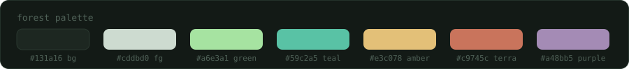

# dotfiles

fedora 44 + niri. every app themed to one "forest" palette.



## what's inside

- **wm**: niri (config.kdl, lock and vpn status scripts)
- **bar**: waybar + swayosd, custom lid/pm toggle modules
- **terminal**: kitty + fish + starship (two-line prompt with pills)
- **launcher**: fuzzel
- **lock**: hyprlock as fallback, the real one is
  [veil](https://github.com/anaidyss/veil) (python + ext-session-lock-v1,
  separate repo)
- **editor**: nvim, lazy.nvim + gruvbox overridden to forest colors
- **the rest**: fastfetch, btop, yazi, bat, eza, zoxide, mako

## install

    ./install.sh

just copies files into ~, no symlinks, keeping it simple. secrets, vpn and
browser configs are not included (secrets live in ~/.config/secrets/env,
gitignored).

font everywhere: JetBrainsMono Nerd Font, lives in ~/.local/share/fonts.

## structure

```text
.config/
  niri/       wayland wm: config.kdl + lock.sh, vpn_status.sh
  waybar/     bar: config, style, lid/pm modules
  kitty/      terminal + forest theme
  fish/       shell config, starship.toml next to it
  nvim/       init.lua + gruvbox overridden to forest
  fuzzel/     launcher
  hypr/       hyprlock fallback
  fastfetch/  system info
  btop/ bat/ yazi/ mako/ swayosd/   the rest, all forest
.local/bin/   wallpaper, screenshot-area, lock-music, lock-battery
install.sh    copies everything into place
```

## custom bits

- **lid-sleep**: systemd user unit + waybar/lid-watcher.sh, suspends the
  laptop on lid close, toggled by clicking the module in the bar
- **wallpaper**: switcher script with list, numbered picker, next/prev and
  random modes, no deps
- **lock-music / lock-battery**: hyprlock widgets, mpris metadata and
  battery with color depending on the charge
- **screenshot-area**: region screenshot, bound to Print and Mod+Shift+S
